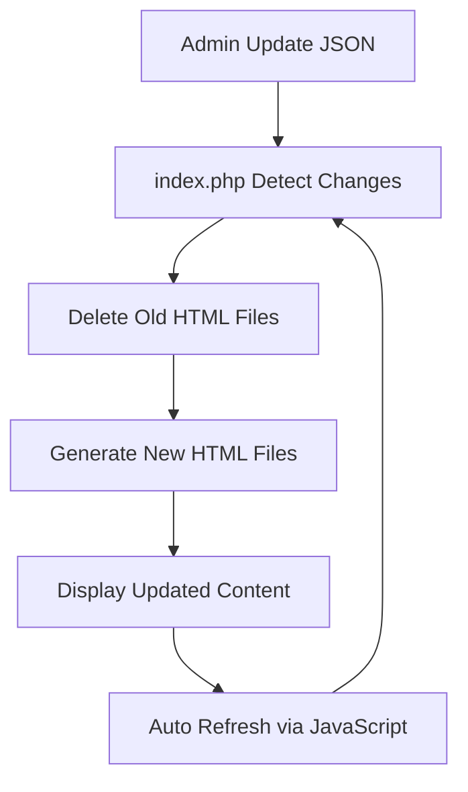

# 📖 Simple JSON-based Static Blog Generator


## 🎯 Deskripsi

Project ini adalah **mini CMS** menggunakan **PHP + JSON** untuk membuat website statis yang simpel namun powerful:

- 📄 Data artikel dan section disimpan dalam file JSON
- ⚡ Setiap kali file JSON berubah, sistem otomatis **generate file HTML** statis
- 🏠 Halaman `index.php` menampilkan **daftar artikel** dan **profile card** (section)
- 🔄 Website auto-refresh jika ada perubahan pada `artikel.json` atau `section.json`

Konsepnya mirip **Static Site Generator** (seperti Hugo/Jekyll) tapi dibuat ringan dengan **PHP native**.

## 📂 Struktur Direktori

```
project/
│
├── data/                 # 📁 Folder penyimpanan data JSON
│   ├── artikel.json      # 📝 Data artikel
│   └── section.json      # 👤 Data section (profile card)
│
├── artikel/              # 🗂️ Hasil generate file HTML artikel
│   ├── judul-1.html
│   ├── judul-2.html
│   └── judul-3.html
│
├── index.php             # 🏠 Halaman utama (generate + tampil artikel/section)
└── README.md             # 📖 Dokumentasi project
```

## 🚀 Cara Install & Menjalankan

1. **Clone repository**
   ```bash
   git clone https://github.com/username/simple-json-blog-generator.git
   cd simple-json-blog-generator
   ```

2. **Setup web server**
   ```bash
   # Menggunakan PHP built-in server
   php -S localhost:8000
   ```

3. **Akses aplikasi**
   ```
   http://localhost:8000
   ```

## 📑 Format Data JSON

### `data/artikel.json`
```json
[
  {
    "title": "Belajar PHP Native untuk Pemula",
    "slug": "belajar-php-native-pemula",
    "content": "PHP adalah bahasa pemrograman server-side yang sangat populer untuk pengembangan web. Artikel ini akan membahas dasar-dasar PHP mulai dari sintaks hingga praktik terbaik."
  },
  {
    "title": "Mengenal JSON dan Penggunaannya",
    "slug": "mengenal-json-dan-penggunaannya", 
    "content": "JSON (JavaScript Object Notation) adalah format pertukaran data yang ringan dan mudah dibaca. Format ini sangat cocok untuk aplikasi web modern."
  }
]
```

### `data/section.json`
```json
[
  {
    "name": "Fathih Apriandi",
    "description": "Web Developer & Backend PHP Enthusiast. Passionate about creating efficient and scalable web applications.",
    "image": "https://dummyimage.com/600x400/4F46E5/FFFFFF?text=Fathih"
  },
  {
    "name": "John Doe",
    "description": "Project Manager. Love to create beautiful and user-friendly interfaces.",
    "image": "https://dummyimage.com/600x400/4F46E5/FFFFFF?text=John"
  },
  {
    "name": "Jane Smith",
    "description": "UI/UX Designer & Content Creator. Love to create beautiful and user-friendly interfaces.",
    "image": "https://dummyimage.com/600x400/EC4899/FFFFFF?text=Jane"
  }
]
```

## ⚙️ Cara Kerja System



1. **📝 Admin Update Data**
   - Artikel dan section ditambah/diedit melalui file JSON
   - Edit langsung `artikel.json` dan `section.json`

2. **⚡ Generate HTML**
   - `index.php` membaca file JSON terbaru
   - Hapus semua file artikel lama dari folder `artikel/`
   - Generate file HTML baru sesuai data JSON

3. **🖥️ Tampilkan Konten**
   - `index.php` menampilkan list artikel + section card
   - Artikel bisa diakses melalui file statis `artikel/slug.html`

4. **🔄 Auto Refresh**
   - JavaScript monitoring perubahan file JSON
   - Auto reload halaman jika terdeteksi perubahan

## 🖼️ Preview Tampilan

### 🏠 Halaman Utama (Index)
- **Daftar Artikel**: Link ke setiap artikel dengan judul yang menarik
- **Section Cards**: Profile card dengan nama, deskripsi, dan gambar
- **Responsive Design**: Tampil sempurna di desktop dan mobile

### 📄 Halaman Artikel
- **Judul Artikel**: `<h1>` yang SEO-friendly
- **Konten Lengkap**: Format paragraf yang mudah dibaca
- **Navigation**: Link kembali ke halaman utama

## 🌟 Fitur Unggulan

- ✅ **CRUD Artikel & Section** berbasis JSON (manual editing)
- ✅ **Auto Generate HTML** statis dari JSON
- ✅ **Real-time Auto Refresh** jika JSON berubah
- ✅ **Clean & Simple Design** dengan CSS global
- ✅ **Auto Sync Artikel** (hapus file lama otomatis)
- ✅ **SEO-Friendly URLs** dengan slug system
- ✅ **Responsive Layout** untuk semua device

## 🛠️ Teknologi yang Digunakan

| Teknologi | Deskripsi | Version |
|-----------|-----------|---------|
| **PHP** | Backend logic & HTML generation | 7.4+ |
| **JSON** | Data storage & configuration | - |
| **HTML5** | Markup & semantic structure | - |
| **CSS3** | Styling & responsive design | - |
| **JavaScript** | Auto-refresh & dynamic behavior | ES6+ |

## 📈 Performance & Benefits

- 🚀 **Super Fast Loading**: File HTML statis tanpa database query
- 💾 **Lightweight**: Hanya butuh web server + PHP
- 🔧 **Easy Maintenance**: Edit JSON langsung tanpa admin panel
- 📱 **Mobile Friendly**: Responsive design untuk semua device
- 🔍 **SEO Optimized**: HTML statis mudah di-crawl search engine

## 📌 Roadmap & Future Development

### Phase 1 (Current) ✅
- [x] Basic CRUD dengan JSON
- [x] HTML static generation
- [x] Auto refresh system
- [x] Simple CSS styling

### Phase 2 (Next) 🚧
- [ ] **Admin Dashboard**: UI untuk CRUD tanpa edit JSON manual
- [ ] **Image Upload**: System upload gambar via web interface
- [ ] **Rich Text Editor**: WYSIWYG editor untuk konten artikel
- [ ] **Categories & Tags**: Sistem kategorisasi artikel

### Phase 3 (Future) 🔮
- [ ] **Search Functionality**: Pencarian artikel dengan JavaScript
- [ ] **Pagination System**: Bagi artikel per halaman
- [ ] **MySQL Integration**: Migrasi ke database untuk skala besar
- [ ] **API Endpoints**: REST API untuk integrasi external

## 🤝 Contributing

Kontribusi sangat welcome! Berikut cara berkontribusi:

1. **Fork** repository ini
2. **Create branch** untuk fitur baru (`git checkout -b feature/amazing-feature`)
3. **Commit** perubahan (`git commit -m 'Add amazing feature'`)
4. **Push** ke branch (`git push origin feature/amazing-feature`)
5. **Open Pull Request**

## 📝 License

Project ini menggunakan **MIT License**. Lihat file [LICENSE](LICENSE) untuk detail lengkap.

## 👨‍💻 Author & Contact

<div align="center">

**Fathih Apriandi**

[](https://linkedin.com/in/fathihapriandi)
[](https://github.com/fathihapriandi)
[](mailto:fathih.apriandi@example.com)

*Web Developer & Backend PHP Enthusiast*  
*Passionate about creating efficient and scalable web applications*

</div>

---

## 🎯 Learning Outcomes

Dengan mengerjakan project ini, kamu akan belajar:

- ✨ **Dasar CRUD** menggunakan PHP + JSON
- 🏗️ **Konsep Static Site Generator** dan implementasinya
- 🔄 **File System Operations** di PHP (read, write, delete)
- 🌐 **Frontend-Backend Integration** sederhana
- 📱 **Responsive Web Design** dengan CSS3
- ⚡ **Real-time Updates** dengan JavaScript Fetch API

---

<div align="center">

### ⭐ Jika project ini bermanfaat, jangan lupa kasih star! ⭐

**Made with ❤️ and ☕ by Fathih Apriandi**

</div>